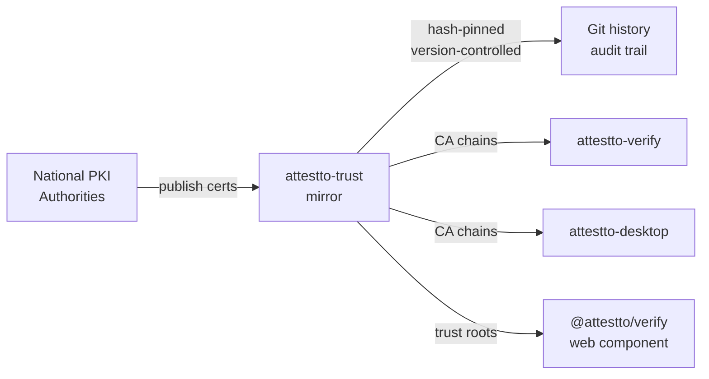

# attestto-trust

[](https://trust.attestto.org)
[](https://www.npmjs.com/package/@attestto/trust)
[](./LICENSE)
[](https://github.com/sponsors/Attestto-com)

> Independent public mirror of national digital signature trust roots and intermediates. Hash-pinned, version-controlled, git history is the audit trail.

**Browse the live directory at [trust.attestto.org](https://trust.attestto.org)** — every mirrored root and intermediate, per country, with its SHA-256 fingerprint, validity window, key algorithm, CRL/OCSP endpoints, and a one-click `.pem` download.

`@attestto/trust` is a critical trust infrastructure piece for the [Attestto Open](https://attestto.org) ecosystem. Most national PKI repositories are partially broken — wrong content-types, half-deployed HTTPS, mixed-case URL quirks, missing branches, dead links. Every developer integrating a country's digital signature stack hits the same wall. This repo mirrors the binary bytes published by each country's issuing authority as-is, hash-pinned, and version-controlled. The legal source of truth remains the issuing authority in each country. We are not a Certificate Authority — we do not issue, reissue, sign, or vouch for any certificate. **Always verify the SHA-256 against the issuing authority's repository when you can reach it.**

## Architecture



## Quick start

### Install

```bash
git clone https://github.com/Attestto-com/attestto-trust.git
cd attestto-trust
pnpm install  # for script dependencies
```

### Use in your app

**Copy certificates to your trust store:**

```bash
cp attestto-trust/countries/cr/current/*.pem your-app/trust-store/cr/
```

**Verify against the bundle:**

```bash
openssl verify -CAfile attestto-trust/countries/cr/current/chain.pem your-signed-doc.pem
```

**Verify a cert's hash:**

```bash
sha256sum attestto-trust/countries/cr/current/root-ca.pem
# compare against attestto-trust/countries/cr/current/manifest.json
```

## Countries

| Country | Package export | Live page | Authority |
|---|---|---|---|
| Costa Rica | [`cr/`](countries/cr) | [trust.attestto.org/cr](https://trust.attestto.org/cr) | BCCR / SINPE / MICITT Firma Digital |
| Brazil | [`br/`](countries/br) | [/br](https://trust.attestto.org/br) | ITI — ICP-Brasil |
| Argentina | [`ar/`](countries/ar) | [/ar](https://trust.attestto.org/ar) | AC Raíz de la República Argentina |
| Spain | [`es/`](countries/es) | [/es](https://trust.attestto.org/es) | FNMT-RCM (Ceres) |
| Austria | [`at/`](countries/at) | [/at](https://trust.attestto.org/at) | RTR / Telekom-Control-Kommission (TKK) eIDAS Trusted List |
| Belgium | [`be/`](countries/be) | [/be](https://trust.attestto.org/be) | FPS Economy (Federal Public Service Economy) eIDAS Trusted List |
| Estonia | [`ee/`](countries/ee) | [/ee](https://trust.attestto.org/ee) | RIA — SK ID Solutions / Zetes (eIDAS) |
| France | [`fr/`](countries/fr) | [/fr](https://trust.attestto.org/fr) | ANSSI eIDAS Trusted List (~20 QTSPs) |
| Germany | [`de/`](countries/de) | [/de](https://trust.attestto.org/de) | Bundesnetzagentur (BNetzA) eIDAS Trusted List |
| Greece | [`gr/`](countries/gr) | [/gr](https://trust.attestto.org/gr) | EETT (Hellenic Telecommunications and Post Commission) eIDAS Trusted List |
| Italy | [`it/`](countries/it) | [/it](https://trust.attestto.org/it) | AgID eIDAS Trusted List (~25 QTSPs) + CIE national eID |
| Netherlands | [`nl/`](countries/nl) | [/nl](https://trust.attestto.org/nl) | RDI (Rijksinspectie Digitale Infrastructuur) eIDAS Trusted List |
| Peru | [`pe/`](countries/pe) | [/pe](https://trust.attestto.org/pe) | INDECOPI — IOFE (RENIEC, ONPE, ECERNEP) |
| Portugal | [`pt/`](countries/pt) | [/pt](https://trust.attestto.org/pt) | GNS — Autoridade Credenciadora / SCEE eIDAS Trusted List |

More countries are staged and land after a per-country promotion review: Mexico, Colombia, Chile, Ecuador, Uruguay, Panama, and other European trusted lists. Italy's full qualified-signature list (229 accredited-QTSP CAs), Germany's (101 accredited-QTSP CAs), Greece's (105 accredited-QTSP CAs), France's (79 accredited-QTSP CAs), the Netherlands' (30 accredited-QTSP CAs), Belgium's (52 accredited-QTSP CAs), Austria's (39 accredited-QTSP CAs), and Portugal's (30 accredited-QTSP CAs) are now live, promoted wholesale after verifying each national Trusted List's XAdES signature through the EU LOTL chain of trust (see `scripts/monitors/verify-eu-tsl.mjs`).

## Global / organizational anchors

Beyond national PKI, the directory mirrors global organizational-identity roots under `anchors/`.
The first is **GLEIF vLEI** (`anchors/gleif-vlei/`) — the GLEIF root of trust and its authorized
Qualified vLEI Issuers, hash-pinned and version-controlled. vLEI is KERI/ACDC (not X.509), so it is
pinned as an AID key-state rather than a CA certificate. We mirror what GLEIF publishes and do not
issue or vouch for any credential. See [trust.attestto.org/gleif](https://trust.attestto.org/gleif).

## Key concepts

### Certificate manifest

Each country has a `manifest.json` listing all certificates with their hashes and metadata:

```json
[
  {
    "filename": "root-ca.pem",
    "sha256": "a1b2c3...",
    "subject": "CN=CA RAIZ NACIONAL - COSTA RICA v2, ...",
    "issuer": "CN=CA RAIZ NACIONAL - COSTA RICA v2, ...",
    "validFrom": "2015-07-09",
    "validTo": "2035-07-09",
    "role": "root"
  },
  ...
]
```

Use this to audit what's installed and verify against the issuing authority's published repository.

### Audit trail

Every cert added, rotated, or retired is a git commit with a clear message describing what changed and why. The full git history is the source of truth for the certificate lifecycle.

```bash
git log --follow countries/cr/current/
```

## Repository layout

```
attestto-trust/
├── README.md                      ← you are here
├── scripts/
│   ├── extract-chain-from-pdf.mjs ← extract certs from signed PDFs
│   ├── generate-exports.mjs       ← regenerate JS/TS exports from PEM files
│   └── refresh-manifest.mjs       ← regenerate manifest.json + chain.pem
├── countries/
│   └── <iso2>/
│       ├── README.md              ← country-specific notes + CA hierarchy
│       ├── current/               ← certs currently active
│       │   ├── *.pem
│       │   ├── chain.pem          ← all-in-one bundle
│       │   └── manifest.json      ← sha256, subject, issuer, valid dates
│       ├── archive/               ← superseded certs, kept forever
│       └── samples/               ← signed docs (when redistributable)
└── .github/workflows/verify.yml   ← CI: verify all cert hashes on every push
```

## Using the certificates

### Drop into your trust store

```bash
git clone https://github.com/Attestto-com/attestto-trust.git
cp attestto-trust/countries/cr/current/*.pem your-app/trust-store/cr/
```

### Verify against the bundle

```bash
openssl verify -CAfile attestto-trust/countries/cr/current/chain.pem some-signer.pem
```

### Verify a cert's hash before using it

```bash
sha256sum attestto-trust/countries/cr/current/root-ca.pem
# compare against attestto-trust/countries/cr/current/manifest.json sha256 field
```

## Updating an existing country

When the issuing authority rotates a cert (root or intermediate):

1. Move the old PEM from `countries/<iso2>/current/` into `countries/<iso2>/archive/<year>/`
2. Drop the new PEM into `countries/<iso2>/current/`
3. Run `node scripts/refresh-manifest.mjs` — rebuilds `manifest.json` + `chain.pem`
4. Run `node scripts/generate-exports.mjs` — regenerates JS exports + `.d.ts` types
5. Commit with a clear message: *"cr: rotate CA SINPE PERSONA FISICA v2 → v3, expires 2032"*
6. Push

## Adding a country

```bash
mkdir -p countries/<iso2>/{current,archive,samples}

# Extract intermediates from any signed sample document for that country
node scripts/extract-chain-from-pdf.mjs ~/Downloads/some-signed.pdf /tmp/out

# Inspect, then move the relevant intermediates into countries/<iso2>/current/
cp /tmp/out/*.pem countries/<iso2>/current/

# Generate manifest + chain.pem + JS exports
node scripts/refresh-manifest.mjs
node scripts/generate-exports.mjs

# Write country-specific notes + CA hierarchy diagram
vi countries/<iso2>/README.md

# Commit
git add countries/<iso2> index.js
git commit -m "<iso2>: initial trust mirror — N certs"
```

Update the country table in this README and open a pull request. CI will verify all hashes.

## Publishing a release

The package is published to npm as [`@attestto/trust`](https://www.npmjs.com/package/@attestto/trust). Publish whenever the certificate set changes (a country added, or a cert rotated).

1. Land the cert changes on `main` and confirm CI is green.
2. Bump the version so the registry and git stay in lockstep — patch for a cert rotation, minor for a new country:
   ```bash
   npm version patch   # or: npm version minor
   ```
3. Publish (the scoped package requires public access; `prepublishOnly` runs the test suite first):
   ```bash
   npm publish --access public
   ```
4. Push the version commit and tag:
   ```bash
   git push --follow-tags
   ```

Never republish an existing version — bump first. The `files` allow-list in `package.json` ships only the JS exports, PEMs, and manifests (no scripts, samples, or archive).

## Limitations

We are **not** a Certificate Authority — we don't issue, reissue, sign, or vouch for any certificate. We are **not** an OCSP/CRL responder — revocation is time-sensitive, get it from the issuing authority directly. We deliberately don't mirror CRLs because a stale CRL is worse than none. If our mirror disagrees with the issuing authority's published repository, the authoritative source wins — open an issue and we'll fix it.

## Ecosystem

| Repo | Role | Relationship |
|---|---|---|
| `attestto-verify` | Web verification component | Uses these trust roots for signature verification |
| `attestto-desktop` | Desktop signer/verifier | Verifies documents against these roots |
| `attestto-anchor` | Solana hash anchoring | Anchors identity & signature metadata |
| `cr-vc-schemas` | Costa Rica credential schemas | Defines the vLEI/Firma Digital signing mechanism |

## Build with an LLM

This repo ships a [`llms.txt`](./llms.txt) context file — a machine-readable summary of the API, data structures, and integration patterns designed to be read by AI coding assistants.

### Recommended setup

Use the [`attestto-dev-mcp`](../attestto-dev-mcp) server to give your LLM active access to the ecosystem:

```bash
cd ../attestto-dev-mcp
npm install && npm run build
```

Then add it to your Claude / Cursor / Windsurf config and ask:

> *"Explore the Attestto ecosystem and help me set up [this component]"*

### Which model?

We recommend **[Claude](https://claude.ai) Pro** (5× usage vs free) or higher. Long context and strong TypeScript reasoning handle this codebase well. The MCP server works with any LLM that supports tool use.

> **Quick start:** Ask your LLM to read `llms.txt` in this repo, then describe what you want to build. It will find the right archetype, generate boilerplate, and walk you through the first run.

## Contributing

We welcome contributions. To add a country, open a PR following the layout above. CI will verify all certificate hashes automatically. For questions about trust roots or PKI hierarchy, open an issue with a reference to the issuing authority's published repository.

## License

The certificates are public-key X.509 published by national issuing authorities; freely redistributable. Scripts and documentation are Apache-2.0. See [LICENSE](./LICENSE).

---

**Provenance:** Maintained by [Attestto](https://attestto.org) as part of public-good work on national digital identity infrastructure. See <https://attestto.org/ark>.

If you find a cert that's missing, expired, or mishashed, open an issue with a sample signed document we can extract from, and we'll get it in.
