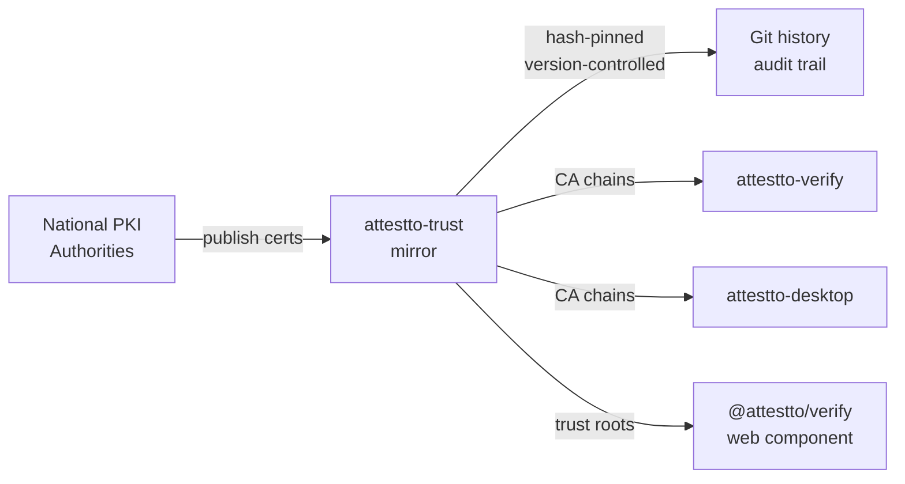

# attestto-trust

> Independent public mirror of national digital signature trust roots and intermediates. Hash-pinned, version-controlled, git history is the audit trail.

A critical trust infrastructure piece for the Attestto Open ecosystem. Most national PKI repositories are partially broken — wrong content-types, half-deployed HTTPS, mixed-case URL quirks, missing branches, dead links. Every developer integrating a country's digital signature stack hits the same wall. This repo mirrors the binary bytes published by official issuers as-is, hash-pinned, and version-controlled. The legal source of truth remains the issuing authority in each country. We are not a Certificate Authority — we do not issue, reissue, sign, or vouch for any certificate. **Always verify the SHA-256 against the official source when you can reach it.**

## Architecture



## Quick start

### Install

```bash
git clone https://github.com/Attestto-com/attestto-trust.git
cd attestto-trust
pnpm install  # for script dependencies
```

### Use in your app

**Copy certificates to your trust store:**

```bash
cp attestto-trust/countries/cr/current/*.pem your-app/trust-store/cr/
```

**Verify against the bundle:**

```bash
openssl verify -CAfile attestto-trust/countries/cr/current/chain.pem your-signed-doc.pem
```

**Verify a cert's hash:**

```bash
sha256sum attestto-trust/countries/cr/current/root-ca.pem
# compare against attestto-trust/countries/cr/current/manifest.json
```

## Countries

| Country | Code | Status | Branches covered |
|---|---|---|---|
| Costa Rica | [`cr/`](countries/cr) | ✅ live | Persona Física + Persona Jurídica |
| Mexico | `mx/` | planned | — |
| El Salvador | `sv/` | planned | — |
| Panama | `pa/` | planned | — |

## Key concepts

### Certificate manifest

Each country has a `manifest.json` listing all certificates with their hashes and metadata:

```json
[
  {
    "filename": "root-ca.pem",
    "sha256": "a1b2c3...",
    "subject": "CN=CA RAIZ NACIONAL - COSTA RICA v2, ...",
    "issuer": "CN=CA RAIZ NACIONAL - COSTA RICA v2, ...",
    "validFrom": "2015-07-09",
    "validTo": "2035-07-09",
    "role": "root"
  },
  ...
]
```

Use this to audit what's installed and verify against the official source.

### Audit trail

Every cert added, rotated, or retired is a git commit with a clear message describing what changed and why. The full git history is the source of truth for the certificate lifecycle.

```bash
git log --follow countries/cr/current/
```

## Repository layout

```
attestto-trust/
├── README.md                      ← you are here
├── scripts/
│   ├── extract-chain-from-pdf.mjs ← extract certs from signed PDFs
│   └── refresh-manifest.mjs       ← regenerate manifest.json with hashes
├── countries/
│   └── <iso2>/
│       ├── README.md              ← country-specific notes + CA hierarchy
│       ├── current/               ← certs currently active
│       │   ├── *.pem
│       │   ├── chain.pem          ← all-in-one bundle
│       │   └── manifest.json      ← sha256, subject, issuer, valid dates
│       ├── archive/               ← superseded certs, kept forever
│       └── samples/               ← signed docs (when redistributable)
└── .github/workflows/verify.yml   ← CI: verify all cert hashes on every push
```

## Using the certificates

### Drop into your trust store

```bash
git clone https://github.com/Attestto-com/attestto-trust.git
cp attestto-trust/countries/cr/current/*.pem your-app/trust-store/cr/
```

### Verify against the bundle

```bash
openssl verify -CAfile attestto-trust/countries/cr/current/chain.pem some-signer.pem
```

### Verify a cert's hash before using it

```bash
sha256sum attestto-trust/countries/cr/current/root-ca.pem
# compare against attestto-trust/countries/cr/current/manifest.json sha256 field
```

## Updating an existing country

When the issuing authority rotates a cert (root or intermediate):

1. Move the old PEM from `countries/<iso2>/current/` into `countries/<iso2>/archive/<year>/`
2. Drop the new PEM into `countries/<iso2>/current/`
3. Run `node scripts/refresh-manifest.mjs <iso2>`
4. Commit with a clear message: *"cr: rotate CA SINPE PERSONA FISICA v2 → v3, expires 2032"*
5. Push

## Adding a country

```bash
mkdir -p countries/<iso2>/{current,archive,samples}

# Extract intermediates from any signed sample document for that country
node scripts/extract-chain-from-pdf.mjs ~/Downloads/some-signed.pdf /tmp/out

# Inspect, then move the relevant intermediates into countries/<iso2>/current/
cp /tmp/out/*.pem countries/<iso2>/current/

# Create the all-in-one bundle
cat countries/<iso2>/current/*.pem > countries/<iso2>/current/chain.pem

# Generate manifest with hashes
node scripts/refresh-manifest.mjs <iso2>

# Write country-specific notes + CA hierarchy diagram
vi countries/<iso2>/README.md

# Commit
git add countries/<iso2>
git commit -m "<iso2>: initial trust mirror — N certs"
```

Update the country table in this README and open a pull request. CI will verify all hashes.

## Limitations

We are **not** a Certificate Authority — we don't issue, reissue, sign, or vouch for any certificate. We are **not** an OCSP/CRL responder — revocation is time-sensitive, get it from the official source. We deliberately don't mirror CRLs because a stale CRL is worse than none. If our mirror disagrees with the official source, the official source wins — open an issue and we'll fix it.

## Ecosystem

| Repo | Role | Relationship |
|---|---|---|
| `attestto-verify` | Web verification component | Uses these trust roots for signature verification |
| `attestto-desktop` | Desktop signer/verifier | Verifies documents against these roots |
| `attestto-anchor` | Solana hash anchoring | Anchors identity & signature metadata |
| `cr-vc-schemas` | Costa Rica credential schemas | Defines the vLEI/Firma Digital signing mechanism |

## Build with an LLM

This repo ships a [`llms.txt`](./llms.txt) context file — a machine-readable summary of the API, data structures, and integration patterns designed to be read by AI coding assistants.

### Recommended setup

Use the [`attestto-dev-mcp`](../attestto-dev-mcp) server to give your LLM active access to the ecosystem:

```bash
cd ../attestto-dev-mcp
npm install && npm run build
```

Then add it to your Claude / Cursor / Windsurf config and ask:

> *"Explore the Attestto ecosystem and help me set up [this component]"*

### Which model?

We recommend **[Claude](https://claude.ai) Pro** (5× usage vs free) or higher. Long context and strong TypeScript reasoning handle this codebase well. The MCP server works with any LLM that supports tool use.

> **Quick start:** Ask your LLM to read `llms.txt` in this repo, then describe what you want to build. It will find the right archetype, generate boilerplate, and walk you through the first run.

## Contributing

We welcome contributions. To add a country, open a PR following the layout above. CI will verify all certificate hashes automatically. For questions about trust roots or PKI hierarchy, open an issue with a reference to the official issuing authority.

## License

The certificates are public-key X.509 published by official institutions; freely redistributable. Scripts and documentation are MIT. See [LICENSE](./LICENSE).

---

**Provenance:** Maintained by [Attestto](https://attestto.org) as part of public-good work on national digital identity infrastructure. See <https://attestto.org/ark>.

If you find a cert that's missing, expired, or mishashed, open an issue with a sample signed document we can extract from, and we'll get it in.
